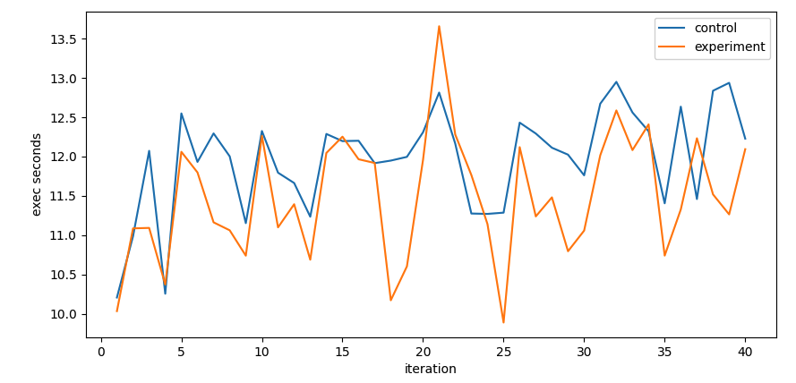
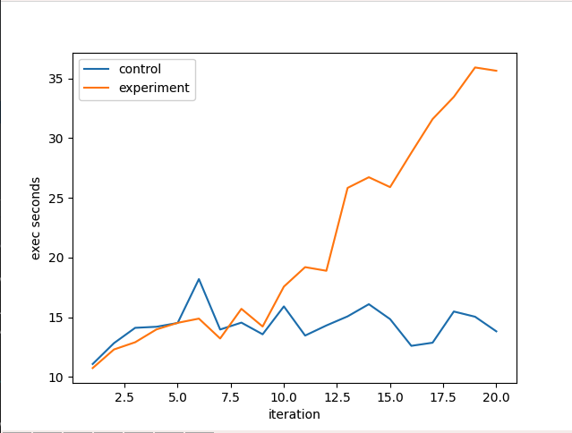
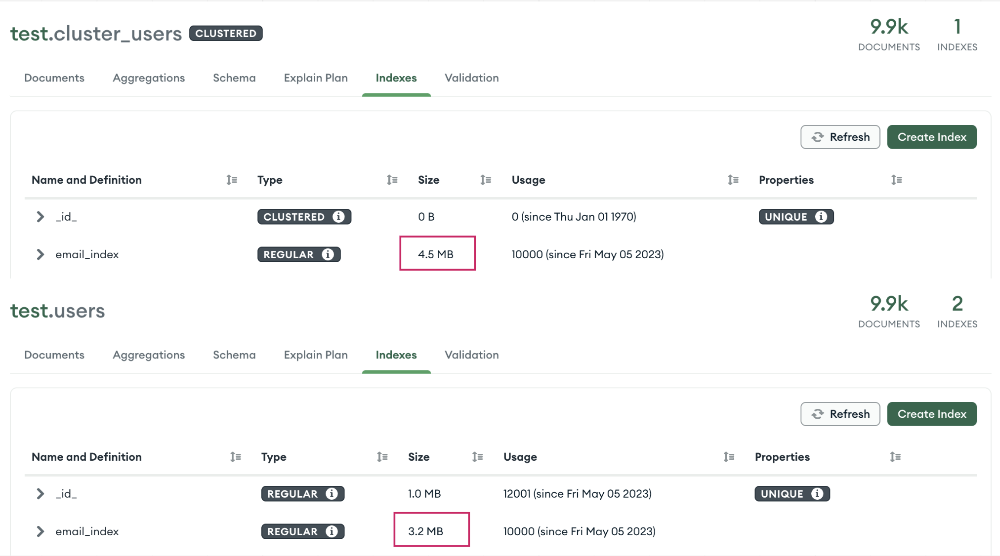

# MongoDB Clustered Collection Benchmark
based on this article , MongoDB support 
clustered collection since 5.3 

Write down some benchmark to test the performance of clustered collection.

## Test Environment
- MacBook Pro M1 (2020) with 16GB RAM
- MongoDB 6.0.5 standalone without any configuration

## Benchmark
Test clustered index and secondary index performance on clustered collection and normal collection.
1. bm/insert.rb: each iteration insert 1e6 documents, total insert 2e7 documents into clustered collection and normal 
   collection.
2. bm/uuid_insert.rb: each time insert 1e6 documents, one with uuid as _id, total insert 1e7 documents into clustered 
   collections
3. bm/search.rb and bm/delete.rb: there are some performance issue [Performance Issue about Clustered Collection : where there are more than one _id search condition, the search would fallback to COLLSCAN](https://jira.mongodb.org/browse/SERVER-76905) so the test is skipped.

## Observation
1. Insert performance of clustered collection is better than normal collection, but not much.

2. Insert performance of clustered collection with uuid as _id is worse than object_id.

3. secondary index performance of clustered collection is larger than normal collection.

4. I found out some performance issue when using find with multiple id search in clustered collection. related issue [Performance Issue about Clustered Collection : where there are more than one _id search condition, the search would fallback to COLLSCAN](https://jira.mongodb.org/browse/SERVER-76905)

## Conclusion
Not recommend to use clustered collection now (MongoDB v6.0.5). The insertion performance is not so obvious. In the 
other 
hand, there 
are bug in clustered collection.
